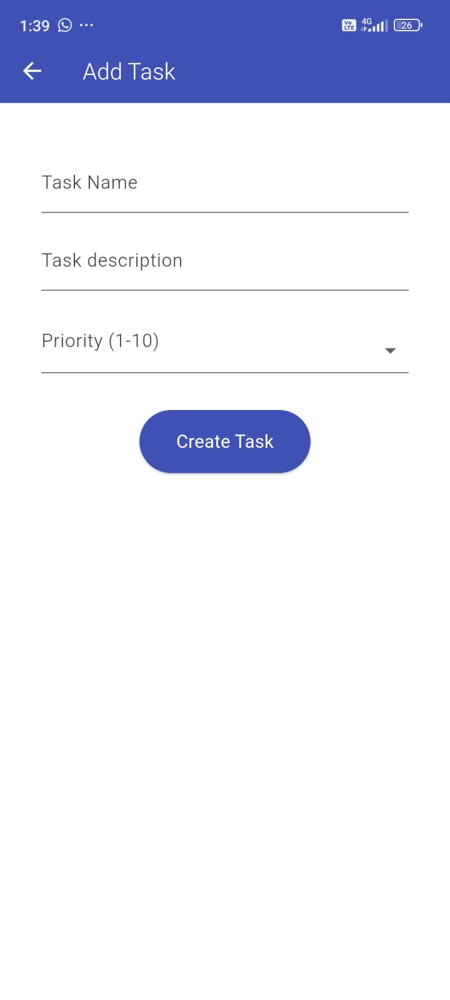

# TodoApp
Este é um aplicativo OpenSource, mantido sobre licensa MIT.


Aplicativo de lista de tarefas, feito em Flutter. Utilizando práticas de clean code, respeitando SOLID e componentização e context isolation, este aplicativo foi criado para suprir a demanda pessoal de uma lista de tarefas minimalista. Testado em Android e Linux Desktop.

Execute:

```flutter run```

Para rodar o código fonte no modo de desenvolvimento.

Versão Android: [APK Mobile Version](./releases/latest.apk)

Versão Linux: Ainda não disponível!

[Linux Version]()


### Features:

- Temas Claro e Escuro
- Criação de Tarefas
- Update de Progressão
- Update de Prioridade
- Marcar como concluída
- Desmarcar como concluída
- Deletar Tarefa
- Recompensa visual e sonora ao concluir tarefa

### Stack:

- Bloc (State Management)
- Isar (Memory Persistency)
- Just Audio (Audio Management)
- Confetti (User Reward)

## Como Utilizar:

- Criar uma tarefa:

Clique no botão de adicionar tarefa




- Aumentar prioridade:

Arraste a tarefa para a direita


- Diminuir a prioridade:

Arraste a tarefa para a esquerda


- Deletar a tarefa:

Segure na tarefa até aparecer um diálogo, selecione a opção "delete"


### Other Screens and More


## Contributing

Contribuições são bem-vindas! Por favor sinta-se a vontade para enviar pull requests para melhorar este projeto. Cofira [CONTRIBUTING.md](./CONTRIBUTING.md) para mais detalhes.

Contributions are welcome! Please feel free to submit issues or pull requests to improve this project. Se [CONTRIBUTING.md](./CONTRIBUTING.md) for more details.

## License

Este projeto está sob Licensa MIT - Confira[LICENSE.md](./LICENSE.md) para mais detalhes.


This project is licensed under the MIT License - see the [LICENSE.md](./LICENSE.md) file for details.